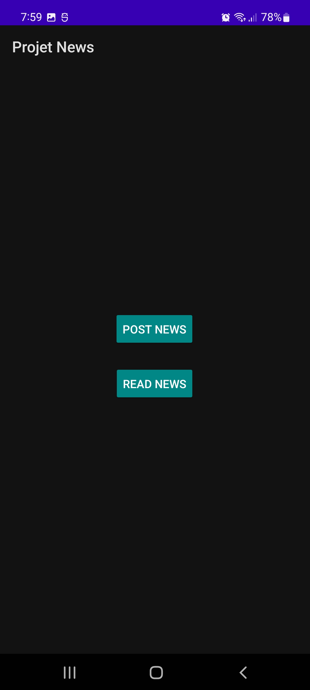
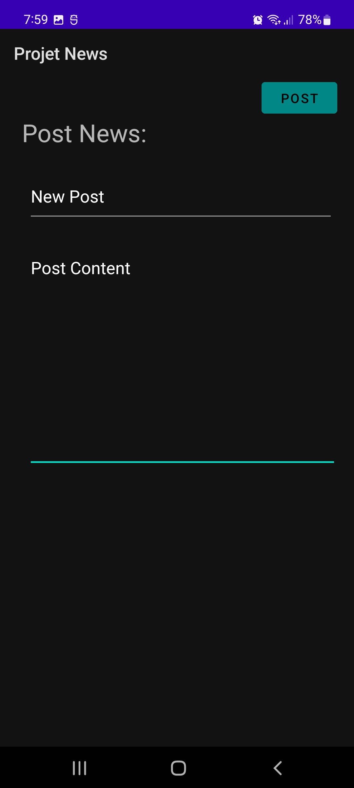
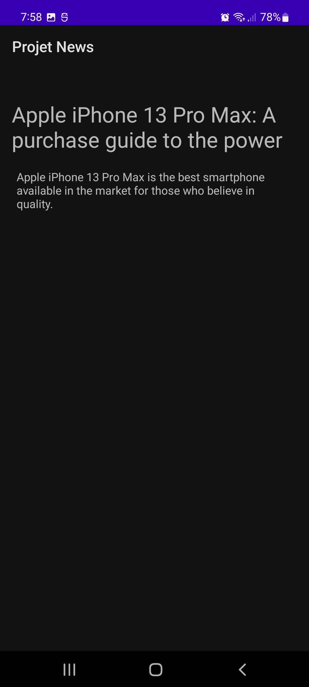

## Android Mini-Project (News App)

This is an Android project that allows users to post and to Read news from an app

The project is composed of 4 Activities.
- A Recycler View to show the list of the posts.
- Firebase to Store/Retrieve news posts.

## Demo:

Main Activity            |  Create Post Activity
:-------------------------:|:-------------------------:
  |  

Posts list Activity             |  Single Post Activity
:-------------------------:|:-------------------------:
  |  

